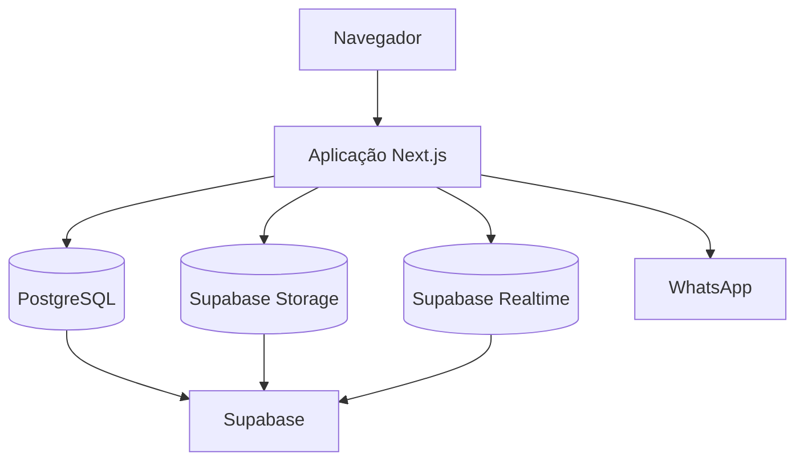
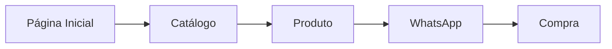
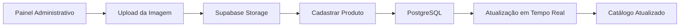
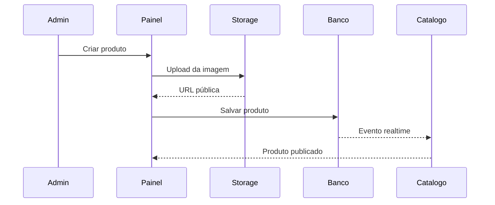
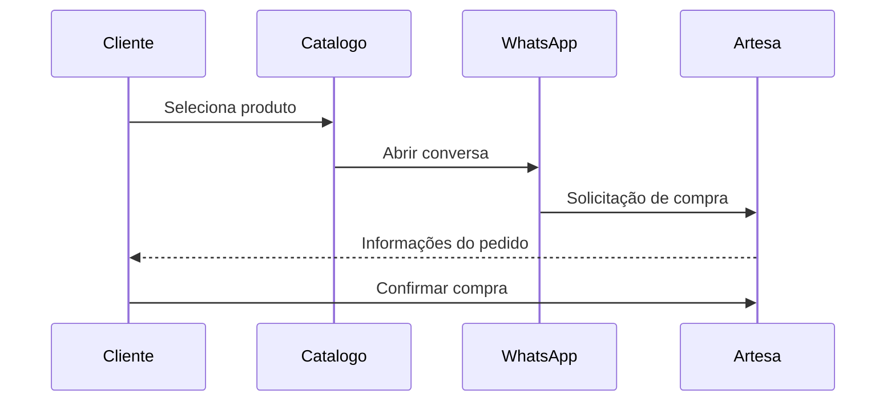
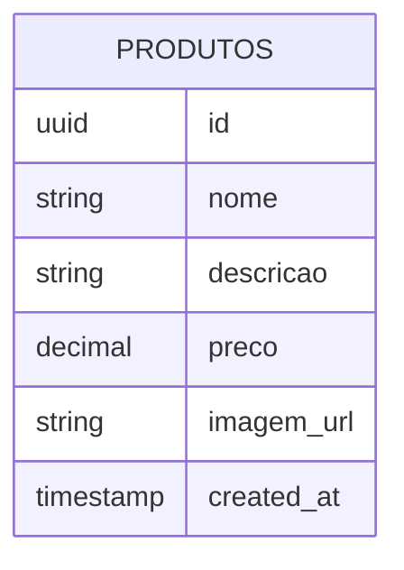

# 🌿 ECOA

<p align="center">
  <strong>Plataforma web para apresentação e comercialização de peças de cerâmica artesanal.</strong>
</p>

<p align="center">
  Desenvolvido com foco em experiência do usuário, identidade visual minimalista e integração simplificada com WhatsApp.
</p>

<p align="center">
  
  
  
</p>

<p align="center">
  
  
  
  
  
</p>

---

<p align="center">
  
</p>

<p align="center">
  <a href="#visão-geral">Visão Geral</a> •
  <a href="#capturas-de-tela">Capturas de Tela</a> •
  <a href="#funcionalidades">Funcionalidades</a> •
  <a href="#como-executar-o-projeto">Como Executar</a> •
  <a href="#documentação-técnica">Documentação Técnica</a> •
  <a href="#próximos-passos">Próximos Passos</a>
</p>

---

# Visão Geral

O ECOA é uma plataforma desenvolvida para uma marca de cerâmica artesanal que busca oferecer uma experiência digital simples, elegante e alinhada aos valores da produção manual.

Ao invés de utilizar um fluxo tradicional de e-commerce, o projeto centraliza a experiência em um catálogo online integrado ao WhatsApp, permitindo um contato mais próximo entre cliente e artesã.

## Objetivos

* Fortalecer a presença digital da marca
* Facilitar a divulgação dos produtos
* Centralizar o gerenciamento do catálogo
* Simplificar o processo de compra
* Reduzir custos operacionais

---

# Capturas de Tela

## Interface Pública

| Home               | Catálogo              |
| ------------------ | --------------------- |
|  |  |

## Painel Administrativo

| Dashboard           |
| ------------------- |
|  |

---

# Funcionalidades

## Área Pública

* Landing page institucional
* Catálogo responsivo
* Atualização em tempo real
* Integração com WhatsApp
* Navegação otimizada para dispositivos móveis

## Área Administrativa

* Cadastro de produtos
* Upload de imagens
* Gerenciamento de preços
* Gerenciamento de descrições
* Atualização instantânea do catálogo

## Infraestrutura

* Banco de dados PostgreSQL
* Supabase Storage
* Supabase Realtime
* Deploy automatizado via Vercel

---

# Por que esta abordagem?

O ECOA foi projetado para manter a operação simples, sustentável e de baixo custo.

### WhatsApp como canal principal

Ao invés de implementar um checkout completo, o sistema direciona o cliente diretamente para o WhatsApp.

Benefícios:

* Atendimento personalizado
* Menor complexidade técnica
* Sem custos com gateways de pagamento
* Comunicação direta com a artesã

### Supabase como Backend

O Supabase concentra:

* Banco de dados
* Armazenamento de imagens
* Atualizações em tempo real

Reduzindo significativamente a necessidade de infraestrutura própria.

### Arquitetura Serverless

A solução foi pensada para ser escalável e de fácil manutenção, permitindo crescimento futuro sem grandes alterações estruturais.

---

# Como Executar o Projeto

## Instalação

Clone o repositório:

```bash
git clone https://github.com/seu-usuario/ecoa.git
```

Acesse o diretório:

```bash
cd ecoa
```

Instale as dependências:

```bash
npm install
```

Inicie o ambiente de desenvolvimento:

```bash
npm run dev
```

A aplicação estará disponível em:

```text
http://localhost:3000
```

---

## Variáveis de Ambiente

Crie um arquivo `.env.local`:

```env
NEXT_PUBLIC_SUPABASE_URL=
NEXT_PUBLIC_SUPABASE_ANON_KEY=
NEXT_PUBLIC_WHATSAPP_NUMBER=
```

| Variável                      | Descrição                     |
| ----------------------------- | ----------------------------- |
| NEXT_PUBLIC_SUPABASE_URL      | URL do projeto Supabase       |
| NEXT_PUBLIC_SUPABASE_ANON_KEY | Chave pública do projeto      |
| NEXT_PUBLIC_WHATSAPP_NUMBER   | Número utilizado para contato |

---

# Documentação Técnica

## Arquitetura



---

## Fluxos do Sistema

### Jornada do Cliente



### Fluxo Administrativo



### Sequência de Cadastro de Produto



### Fluxo de Compra



---

## Modelo do Banco de Dados



Tabela principal:

```sql
CREATE TABLE produtos (
    id UUID PRIMARY KEY DEFAULT gen_random_uuid(),
    nome TEXT NOT NULL,
    descricao TEXT,
    preco NUMERIC NOT NULL,
    imagem_url TEXT NOT NULL,
    created_at TIMESTAMPTZ DEFAULT NOW()
);
```

---

## Tecnologias Utilizadas

| Camada                     | Tecnologia        |
| -------------------------- | ----------------- |
| Frontend                   | Next.js 14        |
| Linguagem                  | TypeScript        |
| Estilização                | Tailwind CSS v4   |
| Banco de Dados             | PostgreSQL        |
| Backend                    | Supabase          |
| Armazenamento              | Supabase Storage  |
| Atualizações em Tempo Real | Supabase Realtime |
| Hospedagem                 | Vercel            |

---

## Estrutura do Projeto

```bash
ecoa-site
│
├── app
│   ├── admin
│   ├── catalogo
│   ├── layout.tsx
│   ├── page.tsx
│   └── globals.css
│
├── components
│
├── lib
│   └── supabaseClient.ts
│
├── public
│
├── docs
│   ├── cover.png
│   ├── home.png
│   ├── catalog.png
│   └── admin.png
│
├── .env.local
├── package.json
├── tsconfig.json
└── README.md
```

---

# Próximos Passos

## Versão Atual

* [x] Landing Page
* [x] Catálogo de Produtos
* [x] Painel Administrativo
* [x] Cadastro de Produtos
* [x] Upload de Imagens
* [x] Integração com WhatsApp
* [x] Layout Responsivo
* [x] Atualização em Tempo Real

## Próxima Versão

* [ ] Edição de Produtos
* [ ] Exclusão de Produtos
* [ ] Sistema de Busca
* [ ] Categorias de Produtos
* [ ] Melhorias de Validação

## Melhorias Futuras

* [ ] Autenticação com Supabase Auth
* [ ] Sistema de Favoritos
* [ ] Dashboard Analítico
* [ ] Integração com Instagram
* [ ] Suporte a múltiplos idiomas

---

# Licença

Este projeto está licenciado sob a licença MIT.

---

# Autor

**Lorenzo**

GitHub: https://github.com/seu-usuario

LinkedIn: https://linkedin.com/in/seu-usuario

---

<p align="center">
  Desenvolvido com Next.js, TypeScript e Supabase.
</p>
