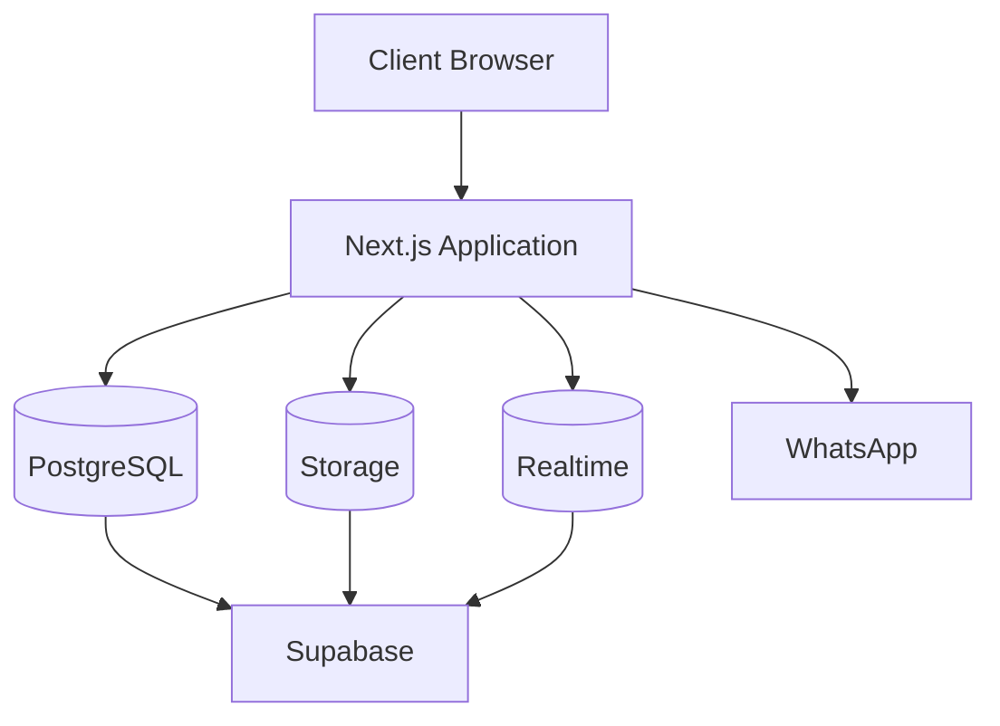
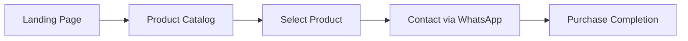
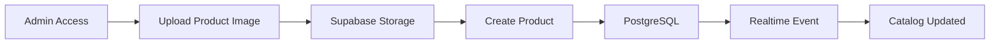
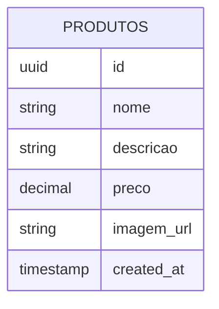

<h1 align="center">🍀 ECOA 🍀</h1>

<p align="center">
  <strong>Plataforma web para apresentação e comercialização de peças de cerâmica artesanal.</strong>
</p>

<p align="center">
  Desenvolvido com foco em experiência do usuário, identidade visual minimalista e integração simplificada com WhatsApp.
</p>

<br>

<p align="center">
  
  
  
</p>

<p align="center">
  
  
  
  
  
</p>

---

<p align="center">
  
</p>

<p align="center">
  <a href="#overview">Overview</a> •
  <a href="#screenshots">Screenshots</a> •
  <a href="#features">Features</a> •
  <a href="#architecture">Architecture</a> •
  <a href="#installation">Installation</a> •
  <a href="#deployment">Deployment</a>
</p>

---

# Overview

O ECOA foi desenvolvido para atender uma marca de cerâmica artesanal que precisava de uma presença digital moderna sem a complexidade de um e-commerce tradicional.

A proposta do projeto é oferecer um catálogo online atualizado em tempo real, permitindo que clientes descubram as peças disponíveis e iniciem o processo de compra diretamente pelo WhatsApp.

Essa abordagem reduz custos operacionais, elimina a necessidade de integração com gateways de pagamento e mantém uma relação mais próxima entre cliente e artesã.

---

# Screenshots

## Home

---

## Product Catalog

---

## Administrative Dashboard

---

# Features

## Public Area

### Institutional Landing Page

* Apresentação da marca
* História e valores
* Design responsivo
* Navegação intuitiva

### Product Catalog

* Listagem dinâmica de produtos
* Atualização em tempo real
* Integração com Supabase
* Experiência otimizada para dispositivos móveis

### WhatsApp Integration

* Redirecionamento instantâneo
* Mensagens pré-formatadas
* Atendimento personalizado

---

## Administrative Area

### Product Management

* Cadastro de produtos
* Upload de imagens
* Atualização de preços
* Atualização de descrições

### Storage Management

* Upload para Supabase Storage
* Geração automática de URLs públicas
* Integração transparente com catálogo

---

# Architecture



---

# User Flow



---

# Administrative Flow



---

# Database Model



Tabela principal utilizada pela aplicação:

```sql
CREATE TABLE produtos (
    id UUID PRIMARY KEY DEFAULT gen_random_uuid(),
    nome TEXT NOT NULL,
    descricao TEXT,
    preco NUMERIC NOT NULL,
    imagem_url TEXT NOT NULL,
    created_at TIMESTAMPTZ DEFAULT NOW()
);
```

Habilitação do Realtime:

```sql
ALTER PUBLICATION supabase_realtime
ADD TABLE produtos;
```

---

# Technology Stack

| Layer                | Technology        |
| -------------------- | ----------------- |
| Frontend             | Next.js 14        |
| Language             | TypeScript        |
| Styling              | Tailwind CSS v4   |
| Database             | PostgreSQL        |
| Backend as a Service | Supabase          |
| File Storage         | Supabase Storage  |
| Realtime Updates     | Supabase Realtime |
| Hosting              | Vercel            |

---

# Project Structure

```bash
ecoa-site
│
├── app
│   ├── admin
│   ├── catalogo
│   ├── layout.tsx
│   ├── page.tsx
│   └── globals.css
│
├── lib
│   └── supabaseClient.ts
│
├── public
│
├── docs
│   ├── cover.png
│   ├── home.png
│   ├── catalog.png
│   └── admin.png
│
├── .env.local
├── package.json
├── tsconfig.json
└── README.md
```

---

# Installation

Clone o repositório:

```bash
git clone https://github.com/seu-usuario/ecoa.git
```

Entre na pasta:

```bash
cd ecoa
```

Instale as dependências:

```bash
npm install
```

Execute o projeto:

```bash
npm run dev
```

A aplicação estará disponível em:

```text
http://localhost:3000
```

---

# Environment Variables

Crie um arquivo `.env.local` na raiz do projeto.

```env
NEXT_PUBLIC_SUPABASE_URL=
NEXT_PUBLIC_SUPABASE_ANON_KEY=
NEXT_PUBLIC_WHATSAPP_NUMBER=
```

| Variable                      | Description                   |
| ----------------------------- | ----------------------------- |
| NEXT_PUBLIC_SUPABASE_URL      | URL do projeto Supabase       |
| NEXT_PUBLIC_SUPABASE_ANON_KEY | Chave pública do projeto      |
| NEXT_PUBLIC_WHATSAPP_NUMBER   | Número utilizado para contato |

---

# Supabase Setup

## Create Project

1. Criar um projeto no Supabase
2. Acessar o SQL Editor
3. Executar a criação da tabela

```sql
CREATE TABLE produtos (
  id UUID DEFAULT gen_random_uuid() PRIMARY KEY,
  nome TEXT NOT NULL,
  descricao TEXT,
  preco NUMERIC NOT NULL,
  imagem_url TEXT NOT NULL,
  created_at TIMESTAMPTZ DEFAULT NOW()
);
```

---

## Create Storage Bucket

Nome sugerido:

```text
imagens-produtos
```

Configuração:

```text
Public Bucket: Enabled
```

---

## Enable Realtime

```sql
ALTER PUBLICATION supabase_realtime
ADD TABLE produtos;
```

---

# Deployment

A aplicação foi projetada para ser implantada utilizando Vercel.

Build local:

```bash
npm run build
```

Deploy:

```bash
git add .
git commit -m "deploy"
git push origin main
```

Após conectar o repositório à Vercel:

1. Configurar as variáveis de ambiente
2. Executar o deploy
3. Publicar a aplicação

---

# Roadmap

## Current Version

* [x] Landing Page
* [x] Product Catalog
* [x] Administrative Dashboard
* [x] Product Registration
* [x] Image Upload
* [x] WhatsApp Integration
* [x] Responsive Layout
* [x] Realtime Updates

---

## Next Release

* [ ] Product Editing
* [ ] Product Deletion
* [ ] Search Functionality
* [ ] Product Categories
* [ ] Improved Validation

---

## Future Improvements

* [ ] Authentication with Supabase Auth
* [ ] Customer Favorites
* [ ] Analytics Dashboard
* [ ] Instagram Feed Integration
* [ ] Multilingual Support

---

# License

This project is licensed under the MIT License.

---

## Author

**Lorenzo**

GitHub: https://github.com/seu-usuario

LinkedIn: https://linkedin.com/in/seu-usuario

---
